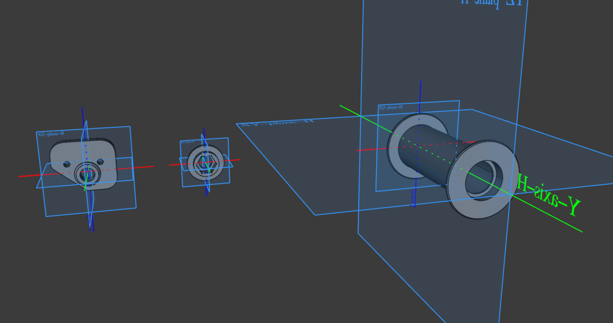

# spool holder
Very easy, fairly useless, simple. Makes the spool easier to roll using some bearings.

I bought my printer used, so the previous owner had already come up with this modification. Since their implementation was blocking the bearings from turning and did not have an endstop — preventing the spool from falling off at the end — like the stock solution, I decided to come up with my own version.

The relevance of this modification is of course questionable the printer had no problems working without it — something, something, better extrusion — the point being that I could learn how to produce parts that have to comply with real-world constraints.

I salvaged most of the parts from the previous owners' solution, except for the roller that had seemed unsalvageable since the bearings were already sitting crooked in it.

